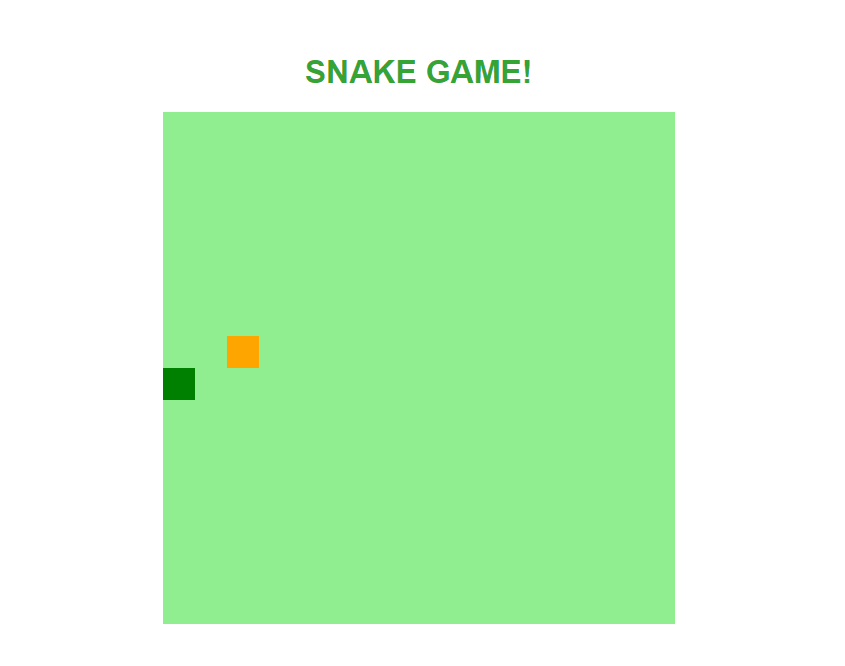
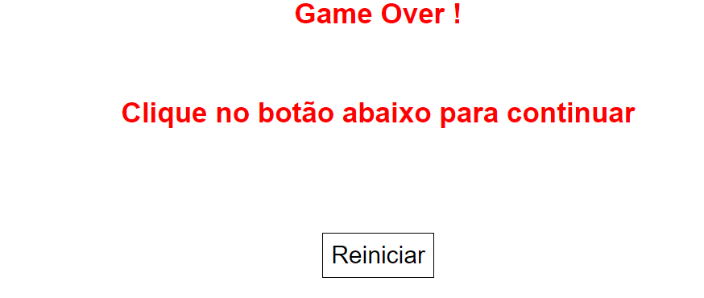

# Snake-Game
Recriação do snake game

### Técnologias usadas
* JS
* CSS
* HTML

### Imagens

> Está parte conta com os conteúdos dinâmicos do JavaScript e uma formtação básica
> A lógica usada é simples
> Após perder o jogo ele direciona para pagina abaixo

> pagina de game over
> botão reiniciar volta para o jogo
